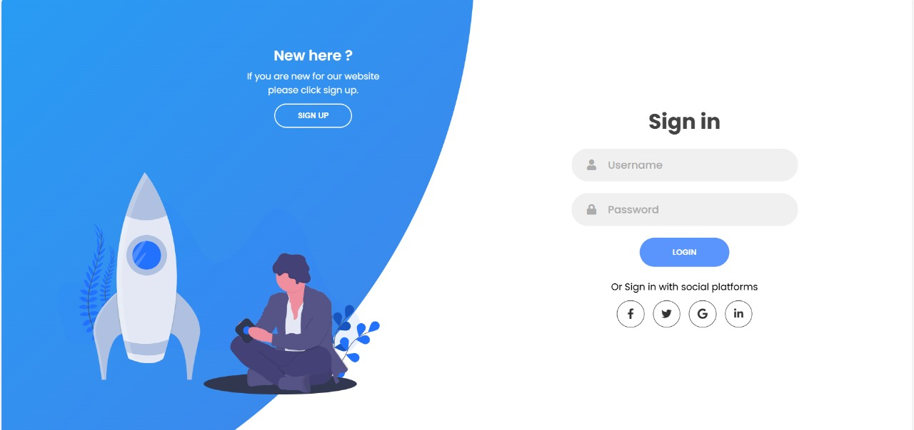

# 🔐 Modern Login Page

A sleek, mobile-friendly login page built using **HTML**, **CSS**, and optionally **JavaScript**. Perfect for modern web applications, portfolio projects, or integration into full-stack systems.

## 📸 Preview

> ✨ **Clean UI, responsive design, and easy to integrate.**

---

## 🚀 Features

- ✅ Responsive design (mobile & desktop)
- ✅ Modern glassmorphism or neumorphism style
- ✅ Password show/hide toggle
- ✅ Input validation with error messages
- ✅ Social media login button placeholders
- ✅ Easy-to-customize UI

---
## 👨‍💻 Developed by
**Allwin E**

🎓 B.Tech IT – K. Ramakrishnan College of Engineering

🏆 Winner – ₹20,000 Prize @ Startup Mela 7.0

📬 Email: allwinedwinofficial@gmail.com

🌐 LinkedIn – [ALLWIN E](https://www.linkedin.com/in/allwin-e-5a7010288/)

📃 License
This project is open-source under the MIT License.
Feel free to use, modify, and distribute with credit.

💡 "Login pages aren't just doors—they're your product’s first impression. Make it awesome!"
